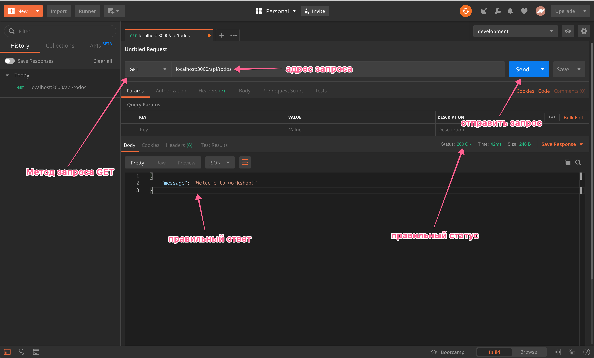

<h1 align="center">
    <a href="https://lectrum.io" target="_blank" rel="noopener noreferrer">
        
    </a>
    Бекенд для планировщика задач
</h1>
<br>

<div align="center">
    <!-- Наш Facebook -->
    <a href="https://www.facebook.com/lectrum">
        
    </a>
</div>
<br>

<h3 align="center">
    👋🏼 Привет и добро пожаловать!
</h3>
<p>
    📸 Вместе мы построим свой API сервер для работы с TODO списком задач.
</p>
<p>
    👨🏼‍🔬 В этой инструкции ты узнаешь как настроить и запустить проект.
</p>
<br>

### 🚀 Для запуска проекта выполни следующие шаги

> Список поддерживаемых нами операционных систем [можно найти здесь](https://github.com/Lectrum/FAQ#%D0%9A%D0%B0%D0%BA%D0%B8%D0%B5-%D0%BE%D0%BF%D0%B5%D1%80%D0%B0%D1%86%D0%B8%D0%BE%D0%BD%D0%BD%D1%8B%D0%B5-%D1%81%D0%B8%D1%81%D1%82%D0%B5%D0%BC%D1%8B-%D0%BF%D0%BE%D0%B4%D0%B4%D0%B5%D1%80%D0%B6%D0%B8%D0%B2%D0%B0%D1%8E%D1%82%D1%81%D1%8F-%D0%BE%D0%B1%D1%83%D1%87%D0%B0%D1%8E%D1%89%D0%B8%D0%BC%D0%B8-%D0%BF%D1%80%D0%BE%D0%B5%D0%BA%D1%82%D0%B0%D0%BC%D0%B8-%D0%BA%D0%BE%D0%BC%D0%BF%D0%B0%D0%BD%D0%B8%D0%B8-lectrum).

1. [Скачай и установи](https://nodejs.org/en/) последнюю LTS-версию Node.js.
2. Выполни в консоли `node -v` и убедись, что установлена последняя версия Node.js не ниже `v10.16.3`;
3. Введи в консоли `npm -v` и убедись, что установлена последняя версия npm не ниже `6.9.0`;
> ❗️ Мы поддерживаем только последние **`LTS-версии Node.js`** (текущая LTS — **`Node 10.16.3`**). Мы не даём гарантий работы на других версиях Node. Если у тебя не работает, в первую очередь проверь версию Node.js!
4. [Скачай и установи Git](https://git-scm.com/downloads), если его нет на компьютере;
> Если ты пользователь Windows, [настрой себе терминал](https://github.com/Lectrum/FAQ#%D0%AF-%D0%BF%D0%BE%D0%BB%D1%8C%D0%B7%D0%BE%D0%B2%D0%B0%D1%82%D0%B5%D0%BB%D1%8C-windows-%D0%9A%D0%B0%D0%BA-%D0%BD%D0%B0%D1%81%D1%82%D1%80%D0%BE%D0%B8%D1%82%D1%8C-%D1%82%D0%B5%D1%80%D0%BC%D0%B8%D0%BD%D0%B0%D0%BB-%D0%B4%D0%BB%D1%8F-%D1%83%D0%B4%D0%BE%D0%B1%D0%BD%D0%BE%D0%B9-%D1%80%D0%B0%D0%B1%D0%BE%D1%82%D1%8B)
для удобной работы.
5. Введи `git --version`, чтобы проверь версию установленного Git, должно быть не ниже `2.22.0`;
6. Склонируй и запусти этот проект:
```bash
git clone https://github.com/Lectrum/workshop-todo-api
```
7. Перейди в проект, выполнив команду:
```bash
cd workshop-todo-api
```
8. В терминале, находясь в директории с текущим проектом, выполни команду:
```bash
npm install
```
9. Чтобы запустить проект в режиме разработки, самое время выполнить команду:
```bash
npm start
```
10. [Скачай и установи Postman](https://www.getpostman.com/downloads/). Эта программа нужна для проверки работы нашего API сервера;
12. Проверь работу сервера при помощи Postman;
